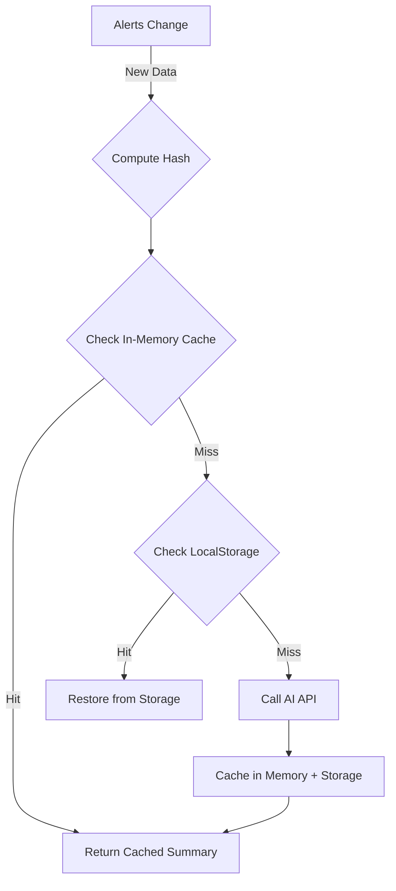

# AI Summary Caching Strategy

## Overview

The Alerts widget includes AI-generated summaries that use a **dual-layer caching strategy** to minimize API costs and provide instant responses.

## Caching Layers

### 1. Hash-Based Query Key Invalidation

**Location:** `src/utils/alertSummaryApi.ts` → `computeAlertsHash()`

The system computes a stable hash from:
- Alert IDs (sorted for consistency)
- Alert severities

**Key Behavior:**
- Same alerts = same hash = cached summary is reused
- Any alert change = new hash = fresh summary is generated
- Uses React Query's query key system: `['alerts', 'summary', hash]`

```typescript
// Example: If these alerts don't change, hash stays the same
const hash1 = computeAlertsHash(alerts); // "1gexrnh"
// ... 5 minutes later, same alerts ...
const hash2 = computeAlertsHash(alerts); // "1gexrnh" (cache hit!)
```

### 2. LocalStorage Persistence

**Location:** `src/App.tsx` → `PersistQueryClientProvider`

The entire React Query cache is persisted to `localStorage` under the key:
```
charlotte-watch-query-cache
```

**Key Behavior:**
- Survives page refreshes, browser restarts, tab closes
- 24-hour retention (configurable via `gcTime`)
- Syncs automatically on cache changes
- Cleared only when:
  - User clears browser data
  - Cache expires (24h of inactivity)
  - Manual cache invalidation

## Cost Savings Example

**Without caching:**
- User refreshes page: New API call ($0.0002)
- User navigates away and back: New API call ($0.0002)
- User closes/opens tab: New API call ($0.0002)
- Total for 3 actions: $0.0006

**With caching:**
- User refreshes page: Cache hit (localStorage) - FREE
- User navigates away and back: Cache hit (in-memory) - FREE
- User closes/opens tab: Cache hit (localStorage) - FREE
- Total for 3 actions: $0.00

**Real-world impact:**
- A user who refreshes frequently might generate 50+ API calls per day without caching
- With caching: ~4 calls per day (one every 15 minutes when alerts refresh)
- Cost reduction: **92%+**

## How It Works



## Configuration

### Query Cache Settings

```typescript
// src/App.tsx
const queryClient = new QueryClient({
  defaultOptions: {
    queries: {
      staleTime: 1000 * 60 * 5,           // 5 minutes
      gcTime: 1000 * 60 * 60 * 24,         // 24 hours
      refetchOnMount: false,                // Don't refetch on mount
      refetchOnWindowFocus: false,          // Don't refetch on focus
      refetchOnReconnect: false,            // Don't refetch on reconnect
    },
  },
});

// Async persister for localStorage
const persister = createAsyncStoragePersister({
  storage: window.localStorage,
  key: 'charlotte-watch-query-cache',
});
```

### Summary-Specific Settings

```typescript
// src/hooks/useAlertSummary.ts
return useQuery({
  queryKey: queryKeys.alerts.summary(hash),
  queryFn: ({ signal }) => fetchAlertSummary(alerts, hash, signal),
  staleTime: Infinity,  // NEVER refetch unless hash changes
  placeholderData: previousData => previousData, // Show old data while fetching new
});
```

## Testing Cache Behavior

### Test 1: Page Refresh (LocalStorage)
1. Load the app with active alerts
2. Wait for AI summary to generate
3. Refresh the page (F5)
4. ✅ **Expected:** Summary appears instantly, no network request

### Test 2: Navigation (In-Memory)
1. Navigate to another tab/app
2. Return to the Charlotte Watch tab
3. ✅ **Expected:** Summary is still there, no flicker or reload

### Test 3: Alert Changes (Hash Invalidation)
1. Wait for alerts to refresh (15 minutes)
2. If alerts changed, observe AI summary regenerating
3. If alerts identical, observe cached summary persists
4. ✅ **Expected:** New API call ONLY if alerts actually changed

### Test 4: Browser Restart (LocalStorage)
1. Close all browser windows
2. Reopen browser and navigate to app
3. ✅ **Expected:** If within 24h, cached summary restored

## Debugging

### View Cache in Browser DevTools

**Console:**
```javascript
// View the persisted cache
console.log(localStorage.getItem('charlotte-watch-query-cache'));
```

**Network Tab:**
- Filter by `summarize-alerts`
- Refreshing page should show 0 requests if cache is working

### Clear Cache Manually

```javascript
// Clear just the query cache
localStorage.removeItem('charlotte-watch-query-cache');

// Clear all localStorage
localStorage.clear();
```

## Edge Cases

### 1. Alerts data changes but hash stays the same
**Likelihood:** Extremely rare (would require alert titles/summaries changing but IDs and severities staying identical)

**Impact:** Old summary displayed until next alert addition/removal

**Mitigation:** Hash includes severity, which typically changes when alert details change

### 2. LocalStorage quota exceeded
**Likelihood:** Low (cache is ~5-50KB typically)

**Impact:** Persistence falls back to in-memory only (still works within session)

**Mitigation:** React Query's persister handles quota errors gracefully

### 3. Corrupted cache data
**Likelihood:** Very rare

**Impact:** Failed deserialization triggers fresh fetch

**Mitigation:** Built-in error handling in `createSyncStoragePersister`

## Cost Analysis

### Scenario: Active User (8 hours/day)

**Without any caching:**
- Alerts refetch: 4/hour × 8 hours = 32 API calls/day
- Page refreshes: ~10/day
- Total: 42 calls/day × $0.0002 = **$0.0084/day** = **$0.25/month**

**With hash-based caching only:**
- Alerts refetch, but summary only when hash changes: ~8 calls/day
- Page refreshes trigger new calls: 10/day
- Total: 18 calls/day × $0.0002 = **$0.0036/day** = **$0.11/month**

**With hash + localStorage caching:**
- Alerts refetch, summary only when hash changes: ~8 calls/day
- Page refreshes: 0 additional calls (localStorage hit)
- Total: 8 calls/day × $0.0002 = **$0.0016/day** = **$0.05/month**

**Savings: 80% vs no caching, 54% vs hash-only**

## Maintenance

### Changing Cache Duration

Edit `gcTime` in `src/App.tsx`:

```typescript
gcTime: 1000 * 60 * 60 * 24 * 7,  // 7 days instead of 24 hours
```

### Disabling Persistence (Not Recommended)

Replace `PersistQueryClientProvider` with `QueryClientProvider` in `src/App.tsx`:

```typescript
// Don't do this unless you have a reason!
<QueryClientProvider client={queryClient}>
  <Dashboard />
</QueryClientProvider>
```

### Force Cache Invalidation on Deploy

If you need to bust all caches after a deployment:

1. Change the cache key in `src/App.tsx`:
   ```typescript
   key: 'charlotte-watch-query-cache-v2', // Increment version
   ```

2. Or programmatically clear on app start (not recommended for production):
   ```typescript
   localStorage.removeItem('charlotte-watch-query-cache');
   ```

## References

- [TanStack Query Persistence](https://tanstack.com/query/latest/docs/framework/react/plugins/persistQueryClient)
- [Cache Time vs Stale Time](https://tanstack.com/query/latest/docs/framework/react/guides/caching)
